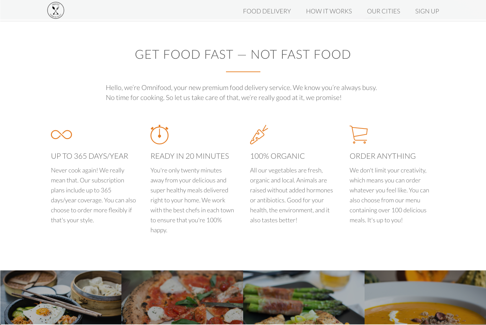

# omnifood

## Fake food delivery service website

Created while taking an online course for the purpose of
learning and practicing HTML and CSS.  One of my first coding projects.  Not very representative of how I write code now.

Links in the navigation bar will scroll to sections of the site.  All other links are dummy-links

View site [here](https://ndstephens.github.io/omnifood/)

 

 

 

 
